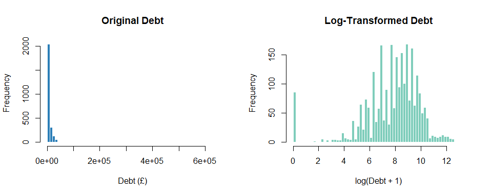
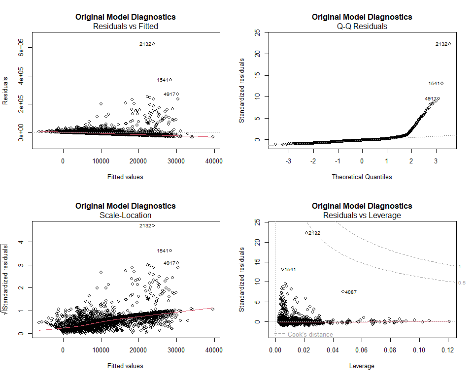

# What Drives Debt at Age 25?
### A Multiple Regression Analysis Using the Next Steps Longitudinal Study (n = 2,613)

## Overview

This project examines what factors affect personal debt among 25-year-olds in England, using data from the [Next Steps study](https://cls.ucl.ac.uk/cls-studies/next-steps/) (formerly LSYPE) — a longitudinal project tracking approximately 16,000 young people across eight waves from 2004 to 2015. Using multiple linear regression, I analyse how demographic, socioeconomic, and attitudinal factors measured between ages 13–21 relate to debt levels at age 25.

Understanding the factors that affect youth debt could contribute to improving financial education policy for young adults.

## Key Findings

- **Housing tenure is the strongest predictor** — mortgage holders carry ~£14,500 more debt than outright homeowners
- **Family background at age 13 predicts debt at age 25** — children of small employers carry 45% more debt, likely reflecting entrepreneurial attitudes towards borrowing
- **Attitudes toward debt at age 16 significantly predict actual debt at 25** — each unit increase in positive attitude is associated with higher debt
- **Culture matters** — ethnically Pakistani respondents have 58% less debt, possibly reflecting family financial support or different financial principles
- **Marriage increases debt by 32%**, likely from joint financial commitments like mortgages
- Both models explain only 4–6% of variance, suggesting debt is driven by many unmeasured individual and contextual factors

## Data

**Source:** Next Steps Sweep 8, available via the [UK Data Service](https://ukdataservice.ac.uk/) (SN 5545). Registration required — the dataset is not included in this repo.

**Sample:** 5,792 original observations → 2,878 after filtering valid debt data → **2,613 final sample** after removing invalid values across all predictors (90.8% retained).

**Variables used:**

| Variable | Description | Wave |
|----------|-------------|------|
| W8QDEB2 | Total debt (£) — *outcome* | 8 (age 25) |
| W8DMARSTAT | Marital status | 8 |
| W8DACTIVITYC | Current activity / employment | 8 |
| W8CMSEX | Gender | 8 |
| W8TENURE | Housing tenure | 8 |
| W1nssecfam | Family NS-SEC classification | 1 (age 13) |
| W1ethgrpYP | Ethnic group | 1 (age 13) |
| W6DebtattYP | Attitude towards debt | 6 (age 21) |

## Exploratory Analysis

The debt distribution is heavily right-skewed — most respondents report lower debt levels while a small number carry very large amounts (up to £650,000). The median debt is £3,000, but the mean is £10,601 due to these outliers. Only 3.29% of respondents report zero debt.

This skewness motivated a log transformation of the outcome variable. The comparison below shows how the transformation normalises the distribution:

## Regression Results

I estimated two OLS models: one on the original debt (£) and one on log-transformed debt (log[debt + 1]).

| Metric | Original Model | Log Model |
|--------|---------------|-----------|
| Adj. R² | 0.057 | 0.041 |
| F-statistic | 6.86 | 5.16 |
| p-value | < 0.001 | < 0.001 |
| AIC | 60,809.7 | 11,412.6 |

The coefficient plot below visualises the log model estimates with 95% confidence intervals. Coefficients crossing the red dashed line (zero) are not statistically significant:

## Diagnostics

The original model showed clear violations of regression assumptions — heteroscedasticity (fan-shaped residuals) and severe non-normality in the Q-Q plot:

The log-transformed model shows substantially improved residual behaviour, supporting its use as the preferred model despite explaining slightly less variance:

## Limitations

- Both models explain minimal variance (4–6%), suggesting many important predictors like education level, income, and loan types are unmeasured
- The model does not establish causal relationships — for example, we cannot determine whether employment causes debt or vice versa
- Missing data reduces sample size and may introduce selection bias

## Tools

R · ggplot2
